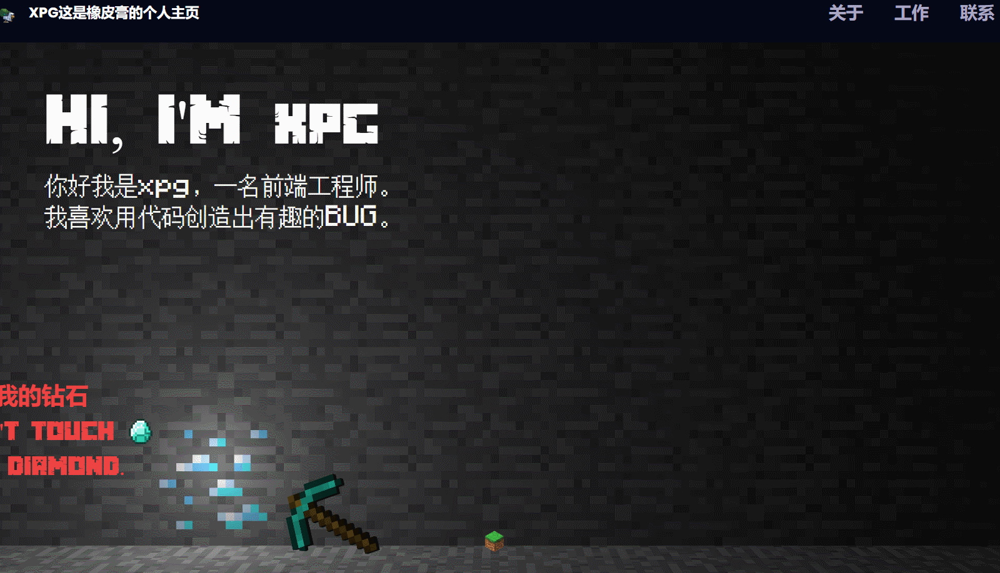

# 项目介绍
作者：橡皮膏

这是一个我的世界游戏主题的个人博客，通过开发此项目，您将获得制作沉浸式 Web 体验、掌握react three3D 库和实现引人入胜的动画的实践经验。如果您只是希望直接运行我的项目，那您可以直接下载我的仓库在您本地的nodejs环境用`npm install`和`npm run dev`来运行，如果您想从0到1自己做一个网站，那您可以查看develop.md

# 演示效果图

如果看不到图片的话可以点击这里
[图片链接](https://github.com/zmrlft/Minecraft-game-themed-3D-personal-blog-react-and-threejs/blob/main/ys.gif)

# 特性
🚀通过点击钻石，会触发僵尸掉落的3D特效

🎨支持自适应设备，在手机上也有良好的显示效果

🎥使用react-three3D库实现的3D动画效果

🎬纯前端项目，适合react初学者，适合第一次制作3D网站的开发者

# 致谢

代码参考自[adrianhajdin](https://github.com/adrianhajdin)，特别感谢adrianhajdin
