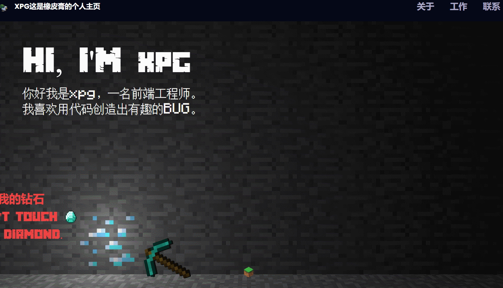
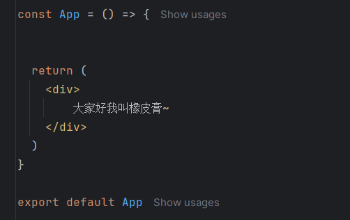
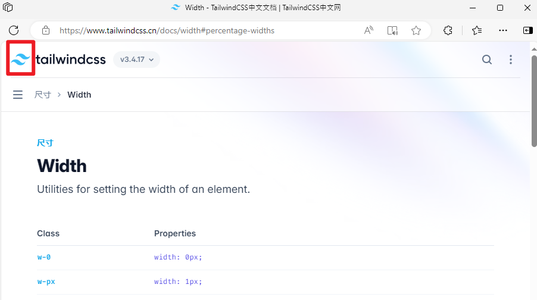
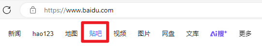
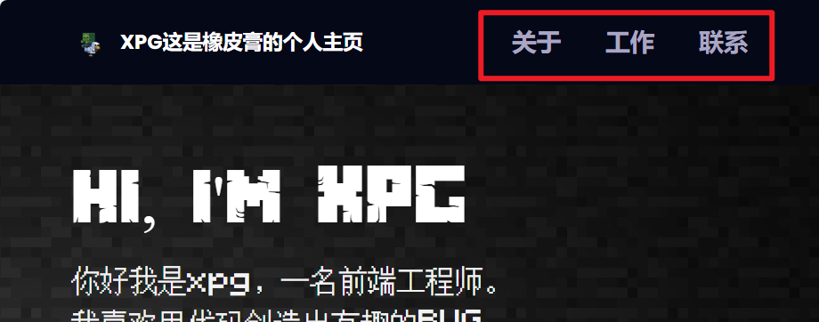
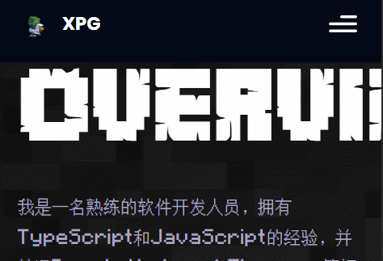

# 从0到1做一个我的世界个人博客开发文档

[toc]


## 项目介绍

### 1. 介绍

这是一个我的世界游戏主题的个人博客，通过开发此项目，您将获得制作沉浸式 Web 体验、掌握 3D 库和实现引人入胜的动画的实践经验。本文档将会告诉您如何从0到1开发一个超级酷的我的世界个人博客，如果您只是希望直接运行我的项目，那您可以直接下载我的仓库在您本地的nodejs环境用`npm install`和`npm run dev`来运行，无需看此文档

**作者** 橡皮膏，XPG[橡皮膏的抖音 - 抖音](https://www.douyin.com/user/self?from_tab_name=main&showTab=post)

2024 © Innei，本软件遵循 AGPLv3 许可证，附加特定的商业使用条件。此外，使用本项目还需要遵循[附加条款和条件](https://github.com/Innei/Shiro/blob/main/ADDITIONAL_TERMS.md)。

代码参考自[adrianhajdin](https://github.com/adrianhajdin)，特别感谢adrianhajdin



🚀通过点击钻石，会触发僵尸掉落的3D特效

🎨支持自适应设备，在手机上也有良好的显示效果

💻主要技术栈：react，three.js，tailwindCSS

项目根据国外的大佬[GitHub - adrianhajdin/project_3D_developer_portfolio：世界上最令人印象深刻的网站使用 3D 图形和动画使其内容栩栩如生。立即了解如何构建您自己的 ThreeJS 3D 开发人员组合！](https://github.com/adrianhajdin/project_3D_developer_portfolio)自己做了二次创作，大佬还有很多作品教程都非常不错，在油管也有视频教程，b站有相关的搬运视频在这[打造让别人眼前一亮的Portfolio（从0到1） - 使用React和Three JS]( https://www.bilibili.com/video/BV1D54y1u7a7/?share_source=copy_web&vd_source=5b8bf5149521f198585074fba6f8d74f)

### 2. 什么人适合本项目

✔基本的要求：了解HTML,CSS,JavaScript（必须项）

✔进阶的要求：了解react（不需要学很深入，了解react组件状态即可）了解tailwindCSS（非必须）

这是一个简单的纯前端教学项目，适合给刚刚学完react的同学练练手，或者对3D前端three.js感兴趣的同学

学完之后你可以在此基础上扩展，这个项目扩展性不错，可以作为自己的在线简历


### 3. 如何参与开源项目

正如你所见，这个项目还在开发中，还有很多功能没有加进去，甚至可能有一些bug或者性能上还可以有所优化，如果你希望贡献你的智慧，我非常欢迎！

贡献使开源社区成为一个学习、激励和创造的绝佳场所。你所作的任何贡献都是**非常感谢**的。

1. Fork the Project
2. Create your Feature Branch (`git checkout -b feature/AmazingFeature`)
3. Commit your Changes (`git commit -m 'Add some AmazingFeature'`)
4. Push to the Branch (`git push origin feature/AmazingFeature`)
5. Open a Pull Request

该项目使用Git进行版本管理。您可以在repository参看当前可用版本。


## 环境准备

请确保电脑安装了node.js和npm和代码编辑器（webstorm或者VSCode)

### 1. npm命令创建一个基于 React 模板的 Vite 项目<br>
`npm create vite@latest ./ -- --template react`<br>
第一个--是一个分隔符，用于区分npm命令本身的参数和传递给vite的参数

这条命令大致意思：用npm创建一个最新版本的vite，模版为react的项目

接下来请按照下面进行选择

✔ Select a framework: › React

✔ Select a variant: › JavaScript

完成后你应该能看到在当前目录下已经生成了项目的结构及其一些文件

### 2. 安装tailwind css和three.js<br>
```npm install --legacy-peer-deps -D tailwindcss postcss autoprefixer```<br>
```npm install --legacy-peer-deps three```<br>
```npx tailwindcss init -p```<br>介绍：[tailwindcss官方网站](https://www.tailwindcss.cn/)这个CSS库还不错，用了这个之后我基本没怎么写过CSS代码了

如果你以前没有接触过这两个库请不用担心，遇到不会就去官网查即可

这里有一些tailwind css 类的例子给你看看

布局类：
flex：将元素设置为弹性容器。
flex-row：将弹性容器的子元素排列在一行。
flex-col：将弹性容器的子元素排列在一列。
justify-between：在弹性容器中，将子元素在主轴上均匀分布，并在两端留有空间。
items-center：在弹性容器中，将子元素在交叉轴上居中对齐。
间距类：
p-4：设置元素的内边距为 1rem。
m-2：设置元素的外边距为 0.5rem。
pt-8：设置元素的上内边距为 2rem。
mb-4：设置元素的下外边距为 1rem。
尺寸类：
w-1/2：设置元素的宽度为父元素宽度的一半。
h-64：设置元素的高度为 16rem。
max-w-md：设置元素的最大宽度为中等尺寸（通常为 768px）。
min-h-screen：设置元素的最小高度为视口的高度。
文本类：
text-center：将文本居中对齐。
text-xl：设置文本的字体大小为 1.25rem。
font-bold：设置文本为粗体。
text-gray-500：设置文本的颜色为灰色系中的 500 号颜色。
背景类：
bg-blue-500：设置元素的背景颜色为蓝色系中的 500 号颜色。
bg-opacity-75：设置元素的背景颜色透明度为 75%。
bg-gradient-to-r：设置元素的背景为从左到右的渐变。
边框类：
border-2：设置元素的边框宽度为 2px。
border-gray-300：设置元素的边框颜色为灰色系中的 300 号颜色。
rounded-lg：设置元素的边框半径为较大的值。
阴影类：
shadow-md：设置元素的阴影为中等大小。
shadow-lg：设置元素的阴影为较大大小。
交互类：
hover:bg-red-500：当鼠标悬停在元素上时，将元素的背景颜色变为红色系中的 500 号颜色。
focus:outline-none：当元素获得焦点时，去除其轮廓线。


### 3. 其他的一些库<br>
`npm install --legacy-peer-deps @react-three/fiber @react-three/drei maath react-tilt react-vertical-timeline-component @emailjs/browser framer-motion react-router-dom`<br>
在安装软件包时，当一个软件包（A）依赖于另一个软件包（B）作为对等依赖（peer dependency）时，正常情况下，npm会尝试安装与软件包 A 要求的版本完全匹配的软件包 B。但是，有时软件包之间的对等依赖关系可能会很复杂，导致版本冲突或安装失败。
使用--legacy-peer-deps选项会告诉npm忽略对等依赖关系中的一些严格版本要求，采用一种更宽松的安装策略。<br>

@react - three/fiber
这是一个用于在 React 应用程序中集成 Three.js 的库。Three.js 是一个强大的 3D 图形库，用于在 Web 浏览器中创建和渲染 3D 场景。

@react - three/drei
这是一个基于@react - three/fiber的辅助库，提供了许多实用的 3D 组件和工具函数，用于快速构建 Three.js 场景。它包含了一些高级的 3D 组件，如天空盒（Skybox）、环境光（AmbientLight）等组件的简单封装

react - tilt
这是一个用于在 React 应用程序中实现倾斜效果（Tilt Effect）的库。当用户与元素（如图片、卡片等）进行交互时，它可以使这些元素产生一种类似于在 3D 空间中倾斜的视觉效果，增加交互的趣味性和吸引力

react - vertical - timeline - component
这是一个用于在 React 应用程序中创建垂直时间轴（Vertical Timeline）组件的库。它提供了一种简单的方式来展示按时间顺序排列的事件或内容。可以用于个人简历、项目历史、事件流程等多种场景的展示。

@emailjs/browser
这是一个用于在浏览器环境中发送电子邮件的库。它允许 Web 应用程序通过简单的 JavaScript 代码与邮件服务进行交互，发送各种类型的电子邮件。

framer - motion
这是一个用于在 React 应用程序中创建动画的高级库。它提供了丰富的动画功能，包括过渡动画、动画序列、手势驱动的动画等。

react - router - dom
这是 React 应用程序中最常用的路由库之一。它用于管理应用程序中的不同页面（在 React 中通常称为组件）之间的导航。通过定义路由规则，可以将 URL 路径与相应的 React 组件进行匹配，使得当用户访问特定的 URL 时，能够正确地渲染对应的组件。
### 4. 预先准备的3D资源和2D素材，react组件，代码<br>
为了避免大家重复性编码为此提供了一套空的react的组件，还有3D，2D素材,css代码,所有文件都放在仓库的“预先准备的素材包”文件夹里

#### 4.1 替换public和assets文件夹，复制components文件夹

把预先准备好的public和assets文件夹覆盖掉初始的public和./src/assets<br>
把components复制到./src/下面，把./src/App.css删除，把App.jsx里的初始内容修改一下，例如




#### 4.2 覆盖原本的index.css和复制styles.js

将预先准备好的index.css覆盖掉初始的./src/index.css，将预先准备好的styles.js复制到./src/<br>
styles.js这段代码定义了一个名为styles的常量对象，主要用于存储一些样式相关的字符串，这些字符串是应用了Tailwind CSS 样式框架，用来设置页面元素的样式，比如内边距、字体大小、文本颜色等属性<br>

#### 4.3 复制tailwind.config.cjs

将预先准备好的tailwind.config.cjs复制到项目文件下，并且把项目初始的tailwind.config.js删除<br>
tailwind.config.cjs这段代码是预先准备好的 Tailwind CSS 配置文件，用于自定义 Tailwind CSS 在项目中的各种行为、样式扩展等内容。它通过 module.exports 向外导出一个配置对象，后面如果我们要改背景图或者字体啥的都可以来这里改<br>

#### 4.4 复制motion.js和index.js

将准备好的utils文件夹复制到./src，这里面的motion.js代码文件里定义了5个函数，这些函数主要用于创建不同类型的动画相关的配置对象<br>

将准备好的constants文件夹复制到./src，里面的index.js是定义好的 services、technologies、experiences、testimonials 和 projects 数据结构，方便在其他地方使用这些数据，
比如在页面渲染组件中，根据这些数据来动态生成展示个人技能、工作经历、项目成果等内容的 UI 界面。数据和展示逻辑分离，使得数据的更新和修改更加独立，也方便我们复用

### 5. 运行
`npm run dev`

如果顺利的话，你应该能看到提示http://localhost:5173/，点击即可看到项目初始化网页

如果运行不起来请尝试自己排错，还是不行可以向我提issue

另外本项目还未完成，文档和项目代码也还有很多不足以及可能有一些错误的地方，你也可以向我提issue和pr，感谢你！

## 开始写~~bug~~代码
### 1. App.jsx <br>
在许多 React 应用程序中，App.jsx（或者App.tsx如果是使用 TypeScript）扮演着根组件的角色。它是整个应用程序组件树的顶层组件，所有其他的组件通常都是在App组件内部或者间接通过App组件引入和挂载的。
在本项目中，App.jsx在main.jsx中调用，而main.jsx在index.html中被调用<br>

首先导入我们需要的包<br>
`import { BrowserRouter } from "react-router-dom";`非常常用的 React 路由库。BrowserRouter 的主要作用是为 React 应用提供路由功能，也就是管理应用中不同页面（在 React 里通常体现为不同组件）之间的导航逻辑，让用户可以通过在浏览器地址栏输入不同的 URL 或者点击页面上的链接等操作，在应用的各个功能模块（由不同组件表示）之间进行切换。<br>
`import { About, Contact, Experience, Feedbacks, Hero, Navbar, Tech, Works, StarsCanvas} from "./components"`导入我们预先提供的react组件

在return的括号里我们把组件依次填进去，先搭好一个大致的框架，确定我们接下来要写什么<br>
```html
 <BrowserRouter>
    <div className="relative z-0 bg-primary">
        <div className="bg-hero-pattern bg-cover bg-no-repeat bg-center">
            <Navbar />
            <Hero />
        </div>
        <About />
        <Experience />
        <Tech />
        <Works />
        <Feedbacks />
        <div className="relative z-0">
            <Contact />
            <StarsCanvas />
        </div>

    </div>
</BrowserRouter>
```
这些组件的用途，看英文翻译就大概了解了，例如About组件就是关于的意思，就是关于我个人的总体介绍，我们会在About组件里写我们的个人介绍啥的，然后Works就是你的工作经历什么的，我们到时候会用react - vertical - timeline - component这个库创建垂直时间轴来展现你的工作经历，Feedback就是别人对你的评价啥的，这里先简单说下，其他没有说到的组件到时候会具体说。

另外你可以发现div后必加类，例如`<div className="relative z-0 bg-primary">`这里的className其实跟原生的html里的class其实是一样的，都是类选择器，只不过react为了跟原生的html区别出来才改成了className。后面是字符串形式的tailwindCSS样式类，这里的bg-primary定义在tailwind.config.cjs文件中,你可以打开tailwind.config.cjs看一下，它通过 extend 扩展了 colors 主题配置，定义了 primary 颜色值为 #050816(黑色)。这样在 Tailwind CSS 中使用 bg-primary 类名时，就会将对应的元素背景颜色设置为这个自定义的颜色值。

```javascript
primary: "#050816"
```
当然这段`<div className="relative z-0 bg-primary">`代码你也可以用原生的CSS来实现，代码如下:

```css
div {
  position: relative; /* 对应 relative 类，设置元素的定位方式为相对定位 */
  z-index: 0; 
  background-color:#050816 ;
}
```

是不是发现还是用tailwindCSS写方便点？官方文档[tailwindcss官方网站](https://www.tailwindcss.cn/)


### 2.导航栏组件Navbar.jsx<br>

#### 2.1 HOME按钮
打开导航栏组件的文件./Components/Navbar.jsx<br>
导入必要的模块，有些模块我加了注释：

```javascript
import React, {useEffect, useState} from 'react';
import { Link } from 'react-router-dom';
// useEffect 是一个 React Hook，用于在函数组件中执行副作用（Side Effects）操作。副作用指的是那些在组件渲染过程之外发生的操作，比如数据获取（发送网络请求获取数据）
// useState 同样是 React Hook，主要用于在函数组件中添加和管理状态（State）。状态是 React 组件中非常重要的概念，它的值决定了组件的渲染结果，并且当状态发生变化时，组件会重新渲染以反映这些变化。
// Link 组件是 react-router-dom 中的组件,来创建可点击的链接，实现页面内的导航
import { styles } from '../styles';
import { navLinks } from '../constants';
import { logo, menu, close }from '../assets';
```
把`<div>Navbar</div>`删除<br>
重新写一个`<nav>`元素，`<nav>`是 HTML 中的一个语义化标签，用于定义导航链接的区域。它可以帮助搜索引擎和浏览器更好地理解页面结构，提升页面的可访问性和语义性。
一般就是用来写网页的导航栏<br>
里面再包裹一个`<div>`,还记得写div后必加类吗？这里两个元素都可以根据自己喜欢的样式来添加className
代码如下

```html
<nav className={`${styles.paddingX} w-full flex items-center py-5 fixed top-0 z-20 bg-primary`}>
    <div className="w-full flex justify-between items-center max-w-7xl mx-auto">
        
    </div>
</nav>
```
接下来只要在`<div>`填东西即可<br>
这段代码使用了 Tailwind CSS 的类名来快速设置样式和布局属性，同时还结合了动态的样式类（如`${styles.paddindX}`）来实现更灵活的样式控制<br>
如果不清楚`w-full flex justify-between`这类Tailwind CSS 类名的话，可以访问[tailwindcss官方网站](https://www.tailwindcss.cn/)查阅官方文档<br>
`styles.paddingX`通过查看styles.js文件的`paddingX: "sm:px-16 px-6"`,可知
paddingX 的样式属性，它的值是一个字符串，包含了针对不同屏幕尺寸（通过媒体查询 sm 来区分）的内边距（padding）设置。这种方式可以实现响应式设计，根据屏幕宽度的不同应用不同的样式规则，以确保页面在各种设备上都能有良好的显示效果。简单地说就是：<span id ="sm">sm是小尺寸屏幕的意思，当网页运行在小尺寸屏幕它就会应用后面的px-6的样式，否则就应用前面的px-16</span>

好了接下来在`<div>`里写一个链接，这个链接是HOME按钮，点击他会自动跳转到网站主页，
我希望他是以图片logo形式展现，类似于tailwind的官网，点击左上角红框的logo图标会重新回到网站主页

实现方式有很多你可以用html`<a>`和``例如

```html
<a href="https://www.home.com">
    
</a>
```
但这是react的教程，所以这里用react的link组件，还记得我们前面从react-router-dom库导入的link组件吧
Link组件内的代码如下：

```javascript
<Link
                  to="/"
                  className="flex items-center gap-2"
                  onClick={() => {
                      setActive("");
                      window.scrollTo(0, 0);
                  }}>

    
                  
                  <p className="text-white text-[18px] font-bold cursor-pointer flex">XPG
                      <span className="sm:block hidden">这是橡皮膏的个人主页</span>
                  </p>

</ Link>

```
注意Link请大写L，如果小写就会变成html原生元素`<link>`，这两个是不一样的

#### 2.2 导航栏项目<br>
下面以百度官网为例子，大部分网页导航栏都有多个项目，并且鼠标悬停有高亮效果，选中选项也有相对应高亮的效果



这是我们实现的效果：



类似这种有导航栏有多个选项的，我们的选项一般都是通过map方法遍历出来的，而被遍历的选项列表其实就来源于我们前面导进来的`import { navLinks } from '../constants';`还记得我们在环境准备章节所复制的constants文件夹和里面的index.js文件吗？我们把数据写在里面了，其实主要还是方便我们后面可能会改数据，比如我想在导航栏组件菜单里加一个选项叫友情链接，那我就直接在index.js里直接加，不用到处找导航栏组件然后在导航栏组件里加。

在Link组件后面补充上以下的代码，这段代码使用了 map 方法遍历了 navLinks 列表中的每个元素
<span id ="nav"></span> 

```html
<ul className="list-none hidden sm:flex flex-row gap-10">
    {navLinks.map((link) => ( // 遍历navLinks数组中的每个元素
    // 为每个li元素设置唯一的key属性,React 使用key属性来区分不同的元素。key就像是每个元素的 “身份证”，能够让 React 高效且准确地识别每个元素。
    <li key={link.id}
        className={`${
    // 当active状态等于当前链接的title时（选项选中状态）为li元素添加"text-white"类名
    // 否则添加"text-secondary"类名,text-secondary在tailwind.config.cjs中定义，用于设置文本颜色为secondary: "#aaa6c3"
    active === link.title
    ? "text-white"
    : "text-secondary"
    } hover:text-white text-[22px] font-bold cursor-pointer`}
    onClick={() => {
    // 当点击链接时，设置active状态为当前链接的title
    setActive(link.title);
    }}
    >
    <a href={`#${link.id}`}>
        {link.title}
    </a>
    </li>
    ))}
</ul>
```


你可能会注意到`setActive(link.title);`这个是什么函数？这就涉及到react的状态了，如果还没有学到react状态的同学可以先去自行了解。这个函数是一个React Hook，用于在函数组件中管理状态。我们需要在组件的最外层使用useState来定义active状态<br>
`const [active, setAction] = useState('');// 定义一个状态变量active,用于存储当前选中的选项，其中setAction是一个函数，用于更新active状态,并使用useState将其初始值设置为空字符串`<br>
这段代码应该补充在`return()`外层，就是Navbar组件最顶层，什么是组件最顶层呢？随便打开一个我们还未修改过的组件查看，你会发现所有的组件都遵循的一样的结构：

```javascript
import React from 'react'

const Works = () => {
  //组件最顶层
  return (
    <div>Works</div>
  )
}

export default Works
```

如果还不确定这段代码应该写在哪里，没关系本章节后面会附上完整的代码

#### 2.3 移动端导航栏
当我们用手机或者小屏幕设备浏览网页时，导航栏太长了，我们希望导航栏有一个折叠的菜单，点击按钮会出现导航栏选项，如下图是在手机上的效果<br>


我们将其称为移动端导航栏

做这个东西我们需要解决两个问题：1，如何实现小屏幕显示移动端导航栏，大屏幕就隐藏

 2，点击移动端导航栏按钮会打开一个小菜单，点击小菜单里的选项会关闭，并且按钮样式会随着打开关闭状态变为三条横杠或一个叉

首先我们来写个按钮，没有按钮哪里来的菜单。先用div元素包裹一个``，里面有两张图menu和close（三条杠的菜单栏logo和一个叉叉的菜单栏关闭样式logo）当点击时，我们通过onClick事件回调函数，通过setToggle设置Toggle状态为其相反值，然后通过三元运算符`src={toggle ? close : menu}`来确定我们要显示哪张图，这时就已经完成了移动端导航栏菜单按钮初始状态是三条杠，点击一下变成叉叉，在点击一下又变成三条杠的效果<br>

那我们点击按钮后如何显示出小菜单呢？很简单，小菜单也用一个div来包裹，通过`!toggle ? "hidden" : "flex"`依旧是通过toggle状态变量来判断小菜单是要hidden（隐藏）还是flex（展现），实现点一下跳出小菜单，在点一下关闭小菜单的功能，然后菜单里的三个选项跟上面写导航栏组件选项一样，其实就是上面写的导航栏项目[点击跳转](#nav)，只是稍微修改了一下样式并且加了一个onClick事件回调函数利用设置toggle值实现点击关闭小菜单的功能。

那第一个问题如何实现？那更加简单了，我们只要通过设置最外一层的`<div>`的className属性来实现，还记得我们前面说的sm吗？[点击跳转到前面有关sm的描述](#sm)`<div className="sm:hidden flex`在屏幕宽度大于640px时隐藏，小于640px时显示。<br>

移动端导航栏代码如下：

```html
{/* 移动端菜单按钮*/}
<div className="sm:hidden flex flex-1 justify-end items-center">
    
            src={toggle ? close : menu} 
            alt="menu"
            className="w-[28px] h-[28px] object-contain cursor-pointer"
            onClick={() =>
    setToggle(!toggle)
    }
    />
    <div
            className={`${
            !toggle ? "hidden" : "flex"
    } p-6 black-gradient absolute top-20 right-0 mx-4 my-2 min-w-[140px] z-10 rounded-xl`}>
    <ul className="list-none flex justify-end items-start flex-col gap-4">
        {navLinks.map((link) => (
        <li key={link.id}
            className={`${
            active === link.title
            ? "text-white"
        : "text-secondary"
        } hover:text-white text-[22px] font-bold cursor-pointer`}
        onClick={() => {
        setToggle(!toggle);
        setActive(link.title);
        }}
        >
        <a href={`#${link.id}`}>
            {link.title}
        </a>
        </li>
        ))}
    </ul>
</div>

</div>
```

以下是对小菜单里选项按钮的补充说明：

点击移动导航栏里的那三个选项时，我希望点击后关闭移动导航栏菜单，通过设置toggle状态来控制显示或隐藏导航栏小菜单，并且还需要设置active状态值为当前所选选项的title值，让我们的组件知道用户选了那个选项以便于切换到相对应的网页
```javascript
onClick={() => {
    setToggle(!toggle);
    setActive(link.title);
}}// 这是一个点击事件的回调函数，当按钮被点击时，会执行以下操作：设置toggle状态为其当前值的相反值（!toggle），并调用setActive函数来更新active状态为当前链接的title，这两个值都是我们导航栏组件的状态，其中title可以让我们的导航栏组件知道我们当前选择的是哪一个选项
```
```javascript
!toggle ? "hidden" : "flex" // 三元运算符，如果toggle为false，由于感叹号取反，显示"hidden"，否则显示"flex"
```
#### 2.4 导航栏完整代码<br>
非常棒！我们已经完成了导航栏的大部分工作，现在让我们来看一下完整代码,如果后续有问题，你可以对照以下代码进行检查
```javascript
import React, {useEffect, useState} from 'react';
import { Link } from 'react-router-dom';

import { styles } from '../styles';
import { navLinks } from '../constants';
import { menu, close, eh, jsyz1} from '../assets';
const Navbar = () => {
  const [active, setAction] = useState('');// 定义一个状态变量active,用于存储当前选中的选项
  const [toggle, setToggle] = useState(false);
  return (
      <nav className={`${styles.paddingX} w-full flex items-center py-5 fixed top-0 z-20 bg-primary`}>
          <div className="w-full flex justify-between items-center max-w-7xl mx-auto">
              <Link
                  to="/"
                  className="flex items-center gap-2"
                  onClick={() => {
                      setActive("");
                      window.scrollTo(0, 0);
                  }}
              >
                  
                  <p className="text-white text-[18px] font-bold cursor-pointer flex">XPG
                      <span className="sm:block hidden">这是橡皮膏的个人主页</span>
                  </p>
              </ Link>
              <ul className="list-none hidden sm:flex flex-row gap-10">
                  {navLinks.map((link) => ( // 遍历navLinks数组中的每个元素
                      // 为每个li元素设置唯一的key属性,React 使用key属性来区分不同的元素。key就像是每个元素的 “身份证”，能够让 React 高效且准确地识别每个元素。
                      <li key={link.id}
                          className={`${
                              // 当active状态等于当前链接的title时（选项选中状态）为li元素添加"text-white"类名
                              // 否则添加"text-secondary"类名,text-secondary在tailwind.config.cjs中定义，用于设置文本颜色为secondary: "#aaa6c3"
                              active === link.title 
                              ? "text-white" 
                              : "text-secondary"
                          } hover:text-white text-[22px] font-bold cursor-pointer`}
                          onClick={() => {
                              // 当点击链接时，设置active状态为当前链接的title
                              setActive(link.title);
                          }}
                      >
                         <a href={`#${link.id}`}>
                             {link.title}
                         </a>
                      </li>
                  ))}
              </ul>
              {/* 移动端菜单按钮*/}
              <div className="sm:hidden flex flex-1 justify-end items-center">
                  
                          setToggle(!toggle)
                      }
                  />
                  <div
                      className={`${
                          !toggle ? "hidden" : "flex"
                      } p-6 black-gradient absolute top-20 right-0 mx-4 my-2 min-w-[140px] z-10 rounded-xl`}>
                      <ul className="list-none flex justify-end items-start flex-col gap-4">
                          {navLinks.map((link) => (
                              <li key={link.id}
                                  className={`${
                                      active === link.title
                                          ? "text-white"
                                          : "text-secondary"
                                  } hover:text-white text-[22px] font-bold cursor-pointer`}
                                  onClick={() => {
                                      setToggle(!toggle);
                                      setActive(link.title);
                                  }}
                              >
                                  <a href={`#${link.id}`}>
                                      {link.title}
                                  </a>
                              </li>
                          ))}
                      </ul>
                  </div>

              </div>


          </div>

      </nav>
  )
}

export default Navbar
```

### 3. 3D模型网站开头页组件Hero.jsx<br>
终于到激动人心的时刻了，我们要开始写3D模型组件了，我猜大多人都是专门来看这节的，这将是最吊的💪！<br>
#### 3.1 Hero.jsx
```javascript
import { motion } from 'framer-motion';

import { styles } from "../styles.js";
import { ComputersCanvas} from "./canvas";
```
老样子，导入必要的模块，其中`motion`是一个用于创建动画效果的 React 组件库，它提供了丰富的动画效果和交互方式。<br>首先我要说明这个组件为什么叫Hero组件英雄组件，这个组件他包含着我们整个网站的标题和一个ComputersCanvas组件，就是我们的开头页，而这个计算机画布组件就是用来渲染我们的3D模型实现僵尸从天上掉下来的效果的组件。后期你可以将3D模型换成别的，比如换成奥特曼发射激光，或者你喜欢的原神角色和英雄人物，所以叫英雄组件。

下面是Hero组件的完整的代码

```javascript
import { motion } from 'framer-motion';

import { styles } from "../styles.js";
import { ComputersCanvas} from "./canvas";

const Hero = () => {
  return (
    <section className={`relative w-full h-screen mx-auto `}>
        <div
            className={`${styles.paddingX} absolute inset-0 top-[120px] max-w-7xl mx-auto flex flex-row items-start gap-5`}
        >
            <div>

                <h5 className={`${styles.heroHeadText} text-white`}>
                    Hi, I'm <span className='text-[65px]'>xpg</span>
                </h5>


                <p className={`${styles.heroSubText} mt-2 text-white-100`}>
                    你好我是xpg，一名前端工程师。
                    <br className='sm:block hidden'/>
                    我喜欢用代码创造出有趣的东西。
                </p>

            </div>


        </div>
        <ComputersCanvas/>
    </section>
  )
}

export default Hero
```
代码结构总体还是比较简单的，`<section>`包含`<div><ComputersCanvas>`元素，其中`<div>`又包含着`<h5>`和`<p>`元素，主要作为网站标题和简介。
`<section>` html5语义化标签的使用可以提高代码的可读性和可维护性，因为它提供了一个清晰的结构，使得开发者可以更容易地理解页面的布局和内容。此外，还可以帮助搜索引擎更好地理解页面的内容，从而提高页面的搜索引擎优化（SEO）效果

这里需要注意：导航栏使用了固定定位`fixed`如果`<section><div>`部分没有考虑到导航栏的占位，就可能导致导航栏遮挡到我们的网站标题和简介，<br>
所以在`<section>下面第一个<div>`元素上添加了`top-[120px]`属性，这个属性表示元素距离顶部的距离为120px，这样就可以避免导航栏遮挡我们的网站标题和简介，你可以试试加这个属性和不加这个属性有何区别。


#### 3.2 MCmodel.jsx 我的世界3D模型组件
MC就是我的世界游戏缩写。我们先放出MCmodel.jsx部分代码随后再来解释，请注意如果你需要复制代码请到本章节最后一小节复制完整的代码
```javascript
import React, {Suspense, useEffect, useRef, useState} from "react"; // 这里的Suspense组件是为了加载模型时显示加载进度条动画
import {Canvas, useFrame} from "@react-three/fiber"; // 这里的Canvas组件是为了创建一个画布
import {OrbitControls, Preload, useAnimations, useGLTF} from "@react-three/drei"; // 这里的OrbitControls是为了创建一个相机控制器，Preload是为了预加载模型,useGLTF是加载模型的一个函数

import CanvasLoader from "../Loader";
import {motion} from "framer-motion";
import {zs1} from "../../assets/";

import '../../index.css';

const MCmodel = (pros) => {
    const { scene, animations } = useGLTF("./wdsj/xl1.glb")
    const { actions } = useAnimations(animations, scene)
    
    const { isMobile , canPlay , onMsg} = pros;

    useEffect(() => {
        if (canPlay) {
            console.log("play");
            actions.Animation.repetitions = 1;
            actions.Animation.timeScale = 0.5;
            actions.Animation.play();
        }

        return () => {
            actions.Animation.stop();
        };
    }, [canPlay]);

    useFrame(({}) => {})

    if (canPlay) {
        // 设置定时器，在动画播放11000毫秒后调用onMsg函数，并清除定时器
        // onMsg又会去调用父组件的stopShowingAnimation函数，从而停止显示动画
        const timeoutId= setTimeout(() => {
            onMsg();
            actions.Animation.stop();//记得停掉动画
            clearTimeout(timeoutId);
        }, 11000);
    }

  return (

      <mesh>
        {/*这里的hemisphereLight是为了创建一个强度为0.15的半球光，groundColor是为了创建一个黑色地面 */}
        <hemisphereLight intensity={8} groundColor='black' />


        {/*object是为了创建一个模型的对象，
        scale是为了创建一个根据屏幕尺寸缩放的模型的缩放比例，
        position是为了创建一个模型的位置，
        rotation是为了创建一个模型的旋转角度 */}
        <primitive
            object={scene}
            scale={isMobile ? 0.2 : 0.25}
            position={isMobile ? [0, 0, -1] : [1, -3.5, -3]}
            rotation={[0, -0, -0]}
        />

      </mesh>

  );
};

```
代码很长但是请不要担心，如果你分为两部分来看的话，你会发现也就那样，我们把return上面的代码作为数据层，把return括号里的代码作为渲染层，你会发现渲染层的代码其实也很像html的元素，尽管这些不是，这些其实是`@react - three/fiber`库里的组件，用于在 React 应用中构建 3D 场景，其中mesh组件是最重要的，所有3D的东西离不开它，一个典型的`<mesh>`组件通常包含两个子元素，一个用于定义几何体（`geometry`），另一个用于定义材质（`material`）。例如：

```html
<mesh>
  <boxGeometry args={[1, 1, 1]} />
  <meshBasicMaterial color="orange" />
</mesh>
```

上面的代码我就定义了一个边长为 1 橙色的立方体

但是我们这里利用的是外部的我的世界模型，我们就不需要用到`geometry`和`material`了，如何导入我们的外部模型呢？此时我们的数据层派上用场了。在数据层中我首先利用用useGLTF函数加载了MC模型xl1.glb文件`const { scene, animations } = useGLTF("./wdsj/xl1.glb");`

我解构出了两个变量scene,和animations，scene可以先简单理解为3D模型本体，我把scene传给了渲染层mesh组件里primitive组件里的object属性，让它帮我把这个3D模型创建出来。接着`const { actions } = useAnimations(animations, scene);`我用`useAnimations` 函数处理 `animations` 并将结果存储在 `actions` 变量中,actions包含了我们模型文件里的动画，在`useFrame`函数里我们播放Anination动画

```javascript
if (canPlay) {// 首先检查canPlay是否为true，能不能播放
            console.log("play");
            actions.Animation.repetitions = 1;//设置动画循环次数1
            actions.Animation.timeScale = 0.5;//倍速0.5
            actions.Animation.play();//播放Animation
    // Animation是模型动画文件里的某一个动画名称，这是在建模软件里设置的，如果你的actions里有跑的动画并且你在建模软件里
    // 将跑的动画命名为run,那么你这里要播放跑的动画得这样写actions.run.play()
        }

```

最后我还写了一个定时器，动画播放结束后会停掉动画，onMsg函数是我在父组件ComputersCanvas里定义的，我们接下来看父组件的代码：

```javascript
const ComputersCanvas = () => {

  // const [isPlaying, setIsPlaying] = useState(false);
  const [isMobile, setIsMobile] = useState(false);// 创建一个状态量用于判断是否为手机
  const [canPlay, setCanPlay] = useState(false);// 创建一个状态量用于判断是否播放模型动画
  const handleClick = () => {
      if(canPlay===false) {
          setCanPlay(true);//这是一个回调函数，在钻石按钮被点击时调用，用于播放模型动画
      }
  }
  const stopShowingAnimation = () => {
      console.log("stopShowingAnimation");// 这是一个回调函数，在模型动画播放完成后调用，用于停止模型动画
      setCanPlay(false);
  };

  useEffect(() => {
    // 为屏幕尺寸添加一个监听事件，检测当前设备的屏幕宽度是否小于等于500像素。如果是，mediaQuery媒体查询对象的matches属性将被设置为true，否则为false。
    const mediaQuery = window.matchMedia("(max-width: 500px)");

    // 用mediaQuery媒体查询对象matches的值设置状态变量isMobile的值
    setIsMobile(mediaQuery.matches);

    // 定义一个回调函数来处理媒体查询的变化
    const handleMediaQueryChange = (event) => {
      setIsMobile(event.matches);
    };

    // 添加一个事件监听器来监听媒体查询的变化
    mediaQuery.addEventListener("change", handleMediaQueryChange);

    // 组件卸载时移除事件监听器，防止内存泄漏
    return () => {
      mediaQuery.removeEventListener("change", handleMediaQueryChange);
    };
  }, []);// useEffect的第二个参数为空数组，表示只在组件挂载时执行一次


    // 下面的Canvas组件是为了创建一个画布,frameloop='demand'是为了创建一个帧循环（减少不必要性能开支，但是这里不要用），shadows是为了创建一个阴影，dpr是为了创建一个设备像素比，camera是为了创建一个相机，
    // gl是为了创建一个WebGL上下文，preserveDrawingBuffer: true表示在绘制完成后保留绘图缓冲区的内容，这在某些情况下可能是有用的，比如需要将渲染结果保存为图像
    // Suspense组件是为了加载模型时显示加载进度条动画
  return (

      <>
          <Canvas
              shadows
              dpr={[1, 2]}
              camera={{position: [0, 0, 0], fov: 90}}
              gl={{preserveDrawingBuffer: true}}
          >


              <Suspense fallback={<CanvasLoader/>}>
                  <OrbitControls
                      enableZoom={false}
                      enableRotate={true}


                  />
                  <MCmodel isMobile={isMobile} canPlay={canPlay} onMsg={stopShowingAnimation} />
              </Suspense>

              <Preload all/>

          </Canvas>
          <div className='absolute xs:bottom-32 bottom-40 flex  items-center ml-5 pl-5' onClick={
              handleClick
          }>

              <motion.div
                  animate={{
                      y: [0, 24, 0],
                  }}
                  transition={{
                      duration: 1.5,
                      repeat: Infinity,
                      repeatType: "loop",
                  }}
                  className='w-30 h-30  mb-1 text-[25px] text-red-500 font-custom '
              >
                  <p className="font-bold sm:text-[30px] text-[15px]">别动我的钻石</p>
                  <div className="font-mc sm:text-[30px] text-[15px]">Don't touch<br/>
                      the diamond.</div>
              </motion.div>
              <motion.div
                  animate={{
                      y: [0, 24, 0],
                      rotateY: [0, 360], // 绕 y 轴旋转 0 到 360 度
                  }}
                  transition={{
                      duration: 1.5,
                      repeat: Infinity,
                      repeatType: "loop",
                  }}
                  className='w-30 h-30  mb-1 '

              >
                  

              </motion.div>
          </div>
      </>


  );
};

export default ComputersCanvas;

```

为什么要写这个计算机画布ComputersCanvas组件呢？事实就是虽然我拥有了MCmodel这个模型组件，但是我还缺一个Canvas画布组件将模型渲染到显示屏上,同时我把控制动画播放的那个钻石按钮写在了ComputerCanvas组件里，还定义了两个状态量isMobile和canPlay，用来判断当前设备是否手机以及能否播放动画。能否播放动画这个状态量是配合钻石按钮来实现点击钻石播放动画的功能，isMobile是因为在手机上我发现模型效果不是很好所以需要这个状态量，检测设备是否手机的这段代码也是那位外国大佬的源代码。我把isMobile的布尔值传递给子组件MCmodel，让子组件来设置模型的缩放和位置，以求在手机上也有相同较为好的模型动画显示效果

#### 3.3 MCmodel.jsx完整代码

```javascript
import React, {Suspense, useEffect, useRef, useState} from "react"; // 这里的Suspense组件是为了加载模型时显示加载进度条动画
import {Canvas, useFrame} from "@react-three/fiber"; // 这里的Canvas组件是为了创建一个画布
import {OrbitControls, Preload, useAnimations, useGLTF} from "@react-three/drei"; // 这里的OrbitControls是为了创建一个相机控制器，Preload是为了预加载模型,useGLTF是加载模型的一个函数

import CanvasLoader from "../Loader";
import {motion} from "framer-motion";
import {zs1} from "../../assets/";

import '../../index.css';

const MCmodel = (pros) => {
    const { scene, animations } = useGLTF("./wdsj/xl1.glb")
    const { actions } = useAnimations(animations, scene)
    
    const { isMobile , canPlay , onMsg} = pros;

    useEffect(() => {
        if (canPlay) {
            console.log("play");
            actions.Animation.repetitions = 1;
            actions.Animation.timeScale = 0.5;
            actions.Animation.play();
        }

        return () => {
            actions.Animation.stop();
        };
    }, [canPlay]);

    useFrame(({}) => {})

    if (canPlay) {
        // 设置定时器，在动画播放11000毫秒后调用onMsg函数，并清除定时器
        // onMsg又会去调用父组件的stopShowingAnimation函数，从而停止显示动画
        const timeoutId= setTimeout(() => {
            onMsg();
            actions.Animation.stop();//记得停掉动画
            clearTimeout(timeoutId);
        }, 11000);
    }

  return (

      <mesh>
        {/*这里的hemisphereLight是为了创建一个强度为0.15的半球光，groundColor是为了创建一个黑色地面 */}
        <hemisphereLight intensity={8} groundColor='black' />


        {/*object是为了创建一个模型的对象，
        scale是为了创建一个根据屏幕尺寸缩放的模型的缩放比例，
        position是为了创建一个模型的位置，
        rotation是为了创建一个模型的旋转角度 */}
        <primitive
            object={scene}
            scale={isMobile ? 0.2 : 0.25}
            position={isMobile ? [0, 0, -1] : [1, -3.5, -3]}
            rotation={[0, -0, -0]}
        />

      </mesh>

  );
};

// 创建一个画布组件
const ComputersCanvas = () => {

  // const [isPlaying, setIsPlaying] = useState(false);
  const [isMobile, setIsMobile] = useState(false);// 创建一个状态量用于判断是否为手机
  const [canPlay, setCanPlay] = useState(false);// 创建一个状态量用于判断是否播放模型动画
  const handleClick = () => {
      if(canPlay===false) {
          setCanPlay(true);//这是一个回调函数，在钻石按钮被点击时调用，用于播放模型动画
      }
  }
  const stopShowingAnimation = () => {
      console.log("stopShowingAnimation");// 这是一个回调函数，在模型动画播放完成后调用，用于停止模型动画
      setCanPlay(false);
  };

  useEffect(() => {
    // 为屏幕尺寸添加一个监听事件，检测当前设备的屏幕宽度是否小于等于500像素。如果是，mediaQuery媒体查询对象的matches属性将被设置为true，否则为false。
    const mediaQuery = window.matchMedia("(max-width: 500px)");

    // 用mediaQuery媒体查询对象matches的值设置状态变量isMobile的值
    setIsMobile(mediaQuery.matches);

    // 定义一个回调函数来处理媒体查询的变化
    const handleMediaQueryChange = (event) => {
      setIsMobile(event.matches);
    };

    // 添加一个事件监听器来监听媒体查询的变化
    mediaQuery.addEventListener("change", handleMediaQueryChange);

    // 组件卸载时移除事件监听器，防止内存泄漏
    return () => {
      mediaQuery.removeEventListener("change", handleMediaQueryChange);
    };
  }, []);// useEffect的第二个参数为空数组，表示只在组件挂载时执行一次


    // 下面的Canvas组件是为了创建一个画布,frameloop='demand'是为了创建一个帧循环（减少不必要性能开支，但是这里不要用），shadows是为了创建一个阴影，dpr是为了创建一个设备像素比，camera是为了创建一个相机，
    // gl是为了创建一个WebGL上下文，preserveDrawingBuffer: true表示在绘制完成后保留绘图缓冲区的内容，这在某些情况下可能是有用的，比如需要将渲染结果保存为图像
    // Suspense组件是为了加载模型时显示加载进度条动画
  return (

      <>
          <Canvas
              shadows
              dpr={[1, 2]}
              camera={{position: [0, 0, 0], fov: 90}}
              gl={{preserveDrawingBuffer: true}}
          >


              <Suspense fallback={<CanvasLoader/>}>
                  <OrbitControls
                      enableZoom={false}
                      enableRotate={true}


                  />
                  <MCmodel isMobile={isMobile} canPlay={canPlay} onMsg={stopShowingAnimation} />
              </Suspense>

              <Preload all/>

          </Canvas>
          <div className='absolute xs:bottom-32 bottom-40 flex  items-center ml-5 pl-5' onClick={
              handleClick
          }>

              <motion.div
                  animate={{
                      y: [0, 24, 0],
                  }}
                  transition={{
                      duration: 1.5,
                      repeat: Infinity,
                      repeatType: "loop",
                  }}
                  className='w-30 h-30  mb-1 text-[25px] text-red-500 font-custom '
              >
                  <p className="font-bold sm:text-[30px] text-[15px]">别动我的钻石</p>
                  <div className="font-mc sm:text-[30px] text-[15px]">Don't touch<br/>
                      the diamond.</div>
              </motion.div>
              <motion.div
                  animate={{
                      y: [0, 24, 0],
                      rotateY: [0, 360], // 绕 y 轴旋转 0 到 360 度
                  }}
                  transition={{
                      duration: 1.5,
                      repeat: Infinity,
                      repeatType: "loop",
                  }}
                  className='w-30 h-30  mb-1 '

              >
                  

              </motion.div>
          </div>
      </>


  );
};

export default ComputersCanvas;

```


可以看到，我在MCmodel.jsx这个组件代码文件里不仅仅写了MCmodel组件，还写了ComputersCanvas父组件，其中MCmodel为其子组件，最后导出也不是导出MCmodel组件而是导出父组件ComputersCanvas。其实按理来说最好就是分开写，但是考虑到我们当前就一个MC模型，没有其他模型需要复用到ComputersCanvas组件的需求，so我就没有把ComputersCanvas组件抽离出来，而且我这个ComputersCanvas组件还需要做对子组件MCmodels的显示进行一些额外的控制，比如我把控制动画播放的钻石按钮写在了父组件ComputersCanvas里

如果对代码不熟悉，可以去查阅react-three-fiber和react-three-drei的文档[react-three官方网站](https://fiber.framer.wiki/)，不用担心，我不会也都是查文档或者问AI的，程序员就是这样

#### 3.4 Loader.jsx 加载进度条组件
这个是可选的，你可以不写这个。

当重新刷新网页时候，你会发现模型加载很慢，这是因为模型文件比较大，所以我们需要一个加载进度条来告诉用户模型正在加载中，加载完成后再显示模型。<br>
刚好 @react-three/drei 库中的 Html 和 useProgress 组件即可实现进度条需求，
useProgress 是一个自定义 Hook，它返回一个对象，包含当前加载进度的百分比。在这个组件中，我们将进度百分比显示在一个` <p> `标签中
以下是完整代码

```javascript
import React from 'react'
import {Html, useProgress} from "@react-three/drei";

const Loader = () => {
  const { progress } = useProgress(); // 获取进度值
  return (
    <Html>
      <span className="canvas-load"></span>
        <p
        style={
          {
            fontSize: 14,
            color: "#f1f1f1",
            fontWeight: 800,
            marginTop: 40,
          }}>3D模型加载中...
          {progress.toFixed(2)}%
        </p>

    </Html>
  )
}
export default Loader
```
### 4. 滚动动画按钮<br>
正在持续更新<br>
#### 4.1 Hero.jsx


### 5. About组件<br>
